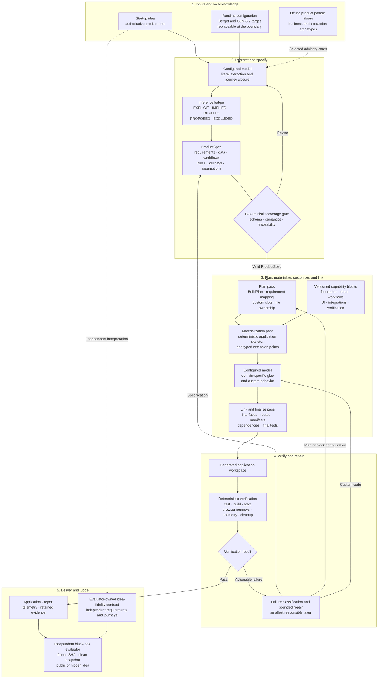

# AgentCofounder high-level system specification

Status: `DRAFT`

Version: `0.1`

Last updated: 2026-08-28

## Purpose

This document defines the target high-level architecture for the AgentCofounder harness: a system that turns a raw startup idea into a complete, locally runnable, tested application.

It is an iterative design document. It describes the intended system and its boundaries; it does not claim that the current harness already implements every part.

The official [starter contract](../README.md) and [organizer checklist](organizer-checklist.md) remain authoritative for external inputs, runtime constraints, required outputs, telemetry, and judging behavior. This specification must fit inside that contract rather than replace it. Provider-specific configuration remains a replaceable runtime concern.

## Status and provenance language

System-level claims use the following labels:

- `CONFIRMED` — established by the authoritative public contract or verified repository evidence.
- `PENDING` — not yet finalized or published by the organizers.
- `ASSUMPTION` — a working inference used for planning, not an official fact.
- `DECISION` — a design choice made by this project.

Requirements inside a generated `ProductSpec` use a separate provenance vocabulary: `EXPLICIT`, `IMPLIED`, `DEFAULT`, `PROPOSED`, and `EXCLUDED`. These terms describe how product behavior relates to the startup idea, not the certainty of hackathon rules.

## 1. Objective

Given an arbitrary plain-text startup idea, the harness should:

1. Interpret the idea without silently dropping important requirements or inventing unrelated product scope.
2. Produce a traceable, machine-valid product specification.
3. Compile repeatable behavior from tested, domain-neutral capability blocks.
4. Use the model for interpretation, product judgment, and genuinely custom code.
5. Build and verify the application in a fresh workspace.
6. Repair actionable failures within a bounded budget.
7. Emit the working application, required reports, telemetry, and audit evidence.

The resulting application should prioritize complete explicit user journeys, product fidelity, usability, and robustness before optional feature breadth.

## 2. Core architectural position

The target is a hybrid compiler architecture with two central intermediate artifacts:

```text
Startup idea -> ProductSpec -> BuildPlan -> Generated application
```

- `ProductSpec` describes **what the product means and must do**.
- `BuildPlan` describes **how the harness will construct and verify it**.

The model and deterministic system have different responsibilities:

- The model interprets ambiguity, drafts the specification, makes bounded product decisions, and writes domain-specific custom code.
- Deterministic components validate contracts, resolve capability blocks, materialize known structures, link outputs, run verification, assemble results, and retain evidence.

> Plan deterministic and custom work together. Materialize deterministic foundations first. Generate custom glue second. Link and verify deterministically afterward.

## 3. System overview



The external evaluator is intentionally outside the repair loop. During official judging, hidden requirements and hidden test results must not become feedback available to the harness.

## 4. External boundaries

### Inputs

The harness receives:

- An authoritative plain-text startup idea.
- Organizer- or operator-supplied runtime configuration.
- A fresh generated-application workspace.
- Bundled, versioned, offline product patterns and capability blocks.

The idea remains authoritative. Product patterns, compiler defaults, and model knowledge may help interpret it but may not override it.

### Outputs

The harness produces:

- A complete application in the required generated workspace.
- Reproducible install, test, build, and start behavior.
- A locally reachable application at the contract-defined address.
- Product summary, implemented features, assumptions, and journey records.
- Harness-owned verification results.
- Model-call telemetry and retained audit evidence.
- All result files required by the submission contract.

The harness must not depend on an internet call at application runtime. The architecture should remain useful when generation and evaluation have no general outbound network access beyond explicitly supplied model infrastructure and dependency installation policy.

## 5. Pipeline contracts

| Stage | Primary owner | Input | Output | Main invariant |
| --- | --- | --- | --- | --- |
| Interpret | Model | Startup idea and selected product patterns | Draft `ProductSpec` | Every interpretation is traceable to the idea or classified as an inference |
| Validate | Deterministic | Draft `ProductSpec` | Valid normalized `ProductSpec` or actionable errors | Invalid, contradictory, or incomplete core journeys cannot silently pass |
| Plan | Deterministic with model-authored spec | Valid `ProductSpec` and block catalogue | `BuildPlan`, manifest, and custom slots | Every included requirement has an implementation and verification path |
| Materialize | Deterministic | `BuildPlan` and capability blocks | Application skeleton and typed extension points | Repeatable mechanics do not need to be reinvented by the model |
| Customize | Model | Materialized workspace and bounded custom slots | Domain-specific glue and custom behavior | Generated code stays within declared ownership boundaries |
| Link | Deterministic | Blocks, manifest, and custom modules | Final assembled workspace | Interfaces, exports, routes, dependencies, and manifests agree |
| Verify | Deterministic | Generated application and journeys | Structured pass/fail evidence | Claims are based on executed checks, not model assertions |
| Repair | Model plus deterministic routing | Classified failure evidence | Revised spec, plan, configuration, or custom code | Repair targets the smallest responsible layer and remains bounded |
| Deliver | Deterministic | Verified workspace and retained events | Contract-valid application, results, and evidence | Required outputs and telemetry are independently assembled |

## 6. ProductSpec

`ProductSpec` is the versioned, declarative representation of the intended product. It is the stable boundary between interpretation and compilation.

The initial schema should cover at least:

- Specification version and source-idea identity.
- Actors and primary user goals.
- Requirements with provenance and source traceability.
- Entities, fields, relationships, and derived values.
- User actions and multi-step workflows.
- State transitions, business rules, and invariants.
- Validation and error behavior.
- Persistence and integration requirements.
- Views, navigation, and important interface states.
- Acceptance journeys.
- Assumptions, exclusions, conflicts, and unresolved ambiguities.
- Product-pattern references used during interpretation.

The exact JSON or TypeScript schema is intentionally deferred to a later specification iteration.

### Requirement provenance

Every requirement or candidate feature should have one of these origins:

- `EXPLICIT` — directly stated in the startup idea.
- `IMPLIED` — logically necessary to make an explicit workflow function end to end.
- `DEFAULT` — a low-cost, domain-neutral quality behavior such as validation, useful feedback, or an empty state.
- `PROPOSED` — an archetype-derived enhancement that could improve the product but is not required.
- `EXCLUDED` — deliberately omitted because it is unsupported, contradictory, unnecessary, or outside the MVP.

Each entry should retain, where applicable:

- A source fragment or source reference.
- The interpretation rationale.
- Confidence.
- Priority.
- Related acceptance journeys.
- Conflicting or negative evidence.

### Default inclusion rule

A feature should be implemented by default only when it is:

1. Explicitly requested;
2. Necessary to complete an explicit journey; or
3. A low-cost, universal quality behavior that does not materially expand scope.

`PROPOSED` features should normally remain recorded but unimplemented. They may be included only when the prompt strongly supports them, explicit requirements are already secure, and the addition does not introduce disproportionate complexity, external dependencies, or verification risk.

Negative evidence is authoritative. For example, a brief stating that the application is for one person on one computer is evidence against adding authentication, teams, and multi-tenancy.

### Interpretation sequence

The model should interpret an idea in four passes:

1. **Literal extraction** — identify users, goals, entities, actions, constraints, negative requirements, and requested outputs.
2. **Journey closure** — infer the minimum supporting behavior needed for each explicit workflow to function end to end.
3. **Quality baseline** — add only relevant domain-neutral usability and robustness defaults.
4. **Pattern consultation** — use selected offline pattern cards to identify invariants, edge cases, dangerous assumptions, and candidate journeys.

The pattern-consultation pass produces hypotheses. It does not automatically add product scope.

### Deterministic coverage gate

Before compilation, validation should establish that:

- Every explicit prompt statement maps to the specification or a recorded conflict.
- Every included feature has a provenance classification.
- Every core workflow has an acceptance journey.
- Required data and state transitions can represent those journeys.
- Assumptions and exclusions are explicit.
- Pattern-derived ideas have not silently become requirements.
- The specification does not contradict negative constraints in the idea.

## 7. Offline product-pattern library

The harness may include a bundled, versioned library of general product knowledge so interpretation does not depend on external research during a run.

The library should be organized along two complementary axes:

- **Business archetypes:** commerce, subscription SaaS, marketplace, booking or service, internal operations, and content products.
- **Interaction archetypes:** catalogue or CRUD, transaction or checkout, status workflow, scheduling, collaboration, search or filtering, and analytics.

Interaction archetypes should drive compilation more directly because they map to behavior and capability blocks. Business archetypes primarily support interpretation and product judgment.

### Pattern-card contract

A product-pattern card may contain:

- Signals indicating when the pattern is relevant.
- Typical user goals and workflows.
- Candidate entities and state transitions.
- Important invariants and edge cases.
- Candidate acceptance-journey templates.
- Common implementation or product failures.
- Dangerous assumptions.
- Features that must not be added automatically.
- Compatible capability blocks.

### Retrieval rules

The library should use progressive disclosure:

1. Keep a compact index available to the interpreter.
2. Select only the small number of patterns supported by prompt evidence.
3. Load only those cards.
4. Record which cards influenced the interpretation.
5. Treat all card-derived product behavior as `PROPOSED` until separately justified.

The library must remain general enough to help with unseen ideas. It must not encode a known challenge prompt, expected records, test-specific labels, or domain vocabulary intended to game evaluation.

## 8. BuildPlan and compiler

The compiler converts a valid `ProductSpec` into a `BuildPlan`.

The plan should declare:

- Selected capability blocks and exact versions.
- Configuration for each block.
- Dependencies and materialization order.
- Required custom extension points.
- File ownership.
- Generated and independent verification journeys.
- A trace from each included requirement to its implementation path.

### Compiler passes

The recommended compiler sequence is:

1. **Plan pass** — resolve blocks, dependencies, configuration, custom slots, and verification obligations.
2. **Materialization pass** — create deterministic files, schemas, interfaces, tests, and the application skeleton.
3. **Agent customization** — have the model implement only the declared domain-specific slots.
4. **Link and finalize pass** — validate custom modules and deterministically assemble exports, routes, registries, manifests, dependencies, and final tests.

Custom coding should not run in parallel with the initial materialization pass. The model should code against stable, real interfaces rather than guessing what the compiler will later produce.

Parallel generation may be considered later for completely independent custom slots with exclusive ownership. It is not part of the initial design.

### File ownership

Generated workspaces should distinguish:

- **Block-owned files** — may be regenerated by the compiler.
- **Agent-owned files** — custom modules that the compiler must not overwrite.
- **Manifest-owned integration** — routes, registries, exports, or composition files generated from declarative inputs.

Directly shared mutable files should be minimized. Recompilation must not silently erase valid custom work.

## 9. Capability blocks

A capability block is a versioned, reusable implementation unit. It is more than a snippet or template.

Each block should define:

- A typed configuration contract.
- Supplied behavior and supported variations.
- Generated files and file ownership.
- Runtime and package dependencies.
- Interfaces exposed to custom code.
- Composition and conflict rules.
- Migrations or upgrade behavior when relevant.
- Deterministic tests and journey primitives.
- Failure messages suitable for repair routing.

Likely block families include:

- Application foundation: package, build, runtime, routing, and layout.
- Data: schemas, repositories, persistence, migrations, and recovery.
- Product behavior: CRUD, filtering, state transitions, derived values, and workflow rules.
- Interface patterns: forms, lists, detail views, navigation, feedback, and responsive states.
- Integrations: payment stub and provider-style adapters.
- Verification: unit, integration, journey, startup, and browser primitives.

Persistence and payment illustrate different block levels:

- **Persistence** is cross-cutting infrastructure. It owns storage mode, schema versioning, durability, recovery, migrations, and a stable repository interface.
- **Payment stub** is an integration and business capability. It owns a provider contract, deterministic fake implementation, transaction states, controlled success or failure behavior, and UI-facing results.

The project should not design an exhaustive catalogue in advance. A block should be added when it represents repeated behavior across distinct ideas or removes a sufficiently risky mechanism from model-generated code.

## 10. Model-generated glue

The model is responsible for work that cannot be safely or appropriately reduced to deterministic configuration.

Suitable responsibilities include:

- Interpreting ambiguous natural language.
- Drafting and repairing `ProductSpec`.
- Choosing among valid product alternatives.
- Creating domain-specific language, views, workflows, and presentation.
- Implementing custom calculations or interactions behind typed interfaces.
- Diagnosing structured compiler, build, and journey failures.
- Using a declared escape hatch when available blocks cannot express required behavior.

The model should not be the final authority for:

- Whether the specification is schema-valid.
- Whether explicit prompt coverage is complete.
- Dependency and file ownership.
- Whether tests, build, startup, or browser journeys passed.
- Result assembly or headline telemetry.
- Whether evidence satisfies the external contract.

The escape hatch is necessary for generality, but it must remain visible in the `BuildPlan` and manifest rather than silently bypassing the compiler.

## 11. Verification and repair

Verification should run after deterministic linking and should produce structured, actionable evidence.

At minimum it should cover:

- ProductSpec schema, semantics, and prompt coverage.
- BuildPlan resolution and block compatibility.
- Dependency and lockfile validity.
- Type or static checks where applicable.
- Unit and integration tests.
- Production build.
- Application startup and port behavior.
- Browser-visible product journeys.
- Required result and telemetry assembly.
- Process cleanup.

### Failure routing

Failures should be repaired at the smallest responsible layer:

- Coverage, ambiguity, or semantic failure -> revise `ProductSpec`.
- Capability selection or configuration failure -> revise `BuildPlan`.
- Block incompatibility -> change configuration or block resolution.
- Interface mismatch -> revise custom code or link inputs.
- Build or runtime defect -> repair the responsible block configuration or custom slot.
- Journey failure -> trace back through the requirement, implementation path, and relevant state transition.

Repair attempt count, time, model calls, and token or cost bounds must remain configurable until official judging limits are confirmed. Every attempt should retain enough evidence to explain what changed and why. Automatic retry without a changed diagnosis is not useful repair.

## 12. Independent evaluation

The evaluator should continue to treat the harness as a black box:

```text
Git repository and ref -> exact resolved commit SHA -> clean snapshot -> isolated run
```

Internal generated tests prove that the application implements the produced `ProductSpec`. They do not independently prove that the `ProductSpec` faithfully captured the raw idea.

Idea fidelity therefore requires evaluator-owned or human-authored requirements and journeys derived independently from the raw startup idea. Evaluation should compare:

- Raw idea -> independent requirement interpretation.
- Raw idea -> generated `ProductSpec` coverage.
- `ProductSpec` -> generated application behavior.
- Reported telemetry -> retained model and session evidence.

The hidden evaluator remains outside the official-run repair loop.

## 13. Model and provider position

- `CONFIRMED` — organizer Ali Leylani states that contest judgment is based on GLM-5.2 through Berget; Qwen 3.8 27B is run only for academic or comparative reporting.
- `INFERENCE` — `zai-org/GLM-5.2` is the intended live Berget slug; it is present in the installed provider extension, but organizers have not separately published the exact slug.
- `DECISION` — prompts, tool contracts, context use, and repair behavior may be measured and optimized for GLM-5.2 while retaining Qwen compatibility evidence.
- `CONSTRAINT` — provider, model, thinking level, endpoint, and credentials remain runtime configuration. GLM-5.2 and Berget must not be hard-coded into the submission contract or core product semantics.
- `PENDING` — exact official thinking level, runtime limits, and the weighting between readiness and efficiency remain subject to organizer confirmation.

Optimizing for the expected judge model should happen at replaceable runtime and prompting seams, not by making the compiler architecture provider-specific.

## 14. Current design decisions

The following positions are accepted for this draft:

1. `ProductSpec` is the central semantic intermediate representation.
2. `BuildPlan` is a separate implementation and verification plan.
3. The architecture is hybrid rather than fully free-form or fully deterministic.
4. Prompt interpretation and provenance are first-class system concerns.
5. Offline product patterns are advisory, selectively retrieved, and never automatically authoritative.
6. The compiler plans all work, materializes deterministic foundations first, and exposes explicit custom slots.
7. Model-generated glue runs after initial deterministic materialization.
8. A deterministic link and finalize pass follows custom generation.
9. Repair is structured, evidence-driven, layer-specific, and bounded.
10. External hidden evaluation cannot provide repair feedback during official judging.
11. Provider and model selection remain configurable even while the system is tuned for the confirmed GLM-5.2-through-Berget judging model.

## 15. Open design questions

The next specification iterations should resolve:

- The exact `ProductSpec` schema and versioning policy.
- How source fragments and traceability are represented.
- The initial product-pattern index and first pattern-card format.
- The first capability-block interface and composition rules.
- The exact `BuildPlan` and build-manifest schemas.
- How custom slots are declared, validated, and protected from recompilation.
- Which universal quality behaviors qualify as `DEFAULT`.
- When a `PROPOSED` feature may be promoted into implementation.
- Repair budgets and stopping conditions.
- How to measure raw-idea fidelity independently from spec-derived tests.
- How the target architecture will be established on a submission line aligned with the complete official starter.

## 16. Recommended next iteration

Use the Book Lending development brief as a worked example without embedding its vocabulary or expected records into reusable compiler code.

The next artifact should be a candidate `ProductSpec v0.1` for that brief, accompanied by a traceability matrix:

```text
Prompt statement -> provenance -> ProductSpec element -> implementation path -> acceptance journey
```

That exercise should test whether the proposed intermediate representation captures the whole idea, distinguishes necessary inference from product invention, and gives the compiler enough information to produce a `BuildPlan`. Only after that review should the exact schema and initial block contracts be frozen.
